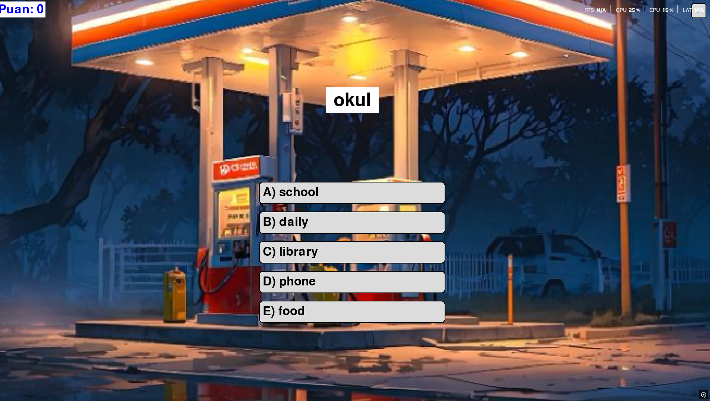
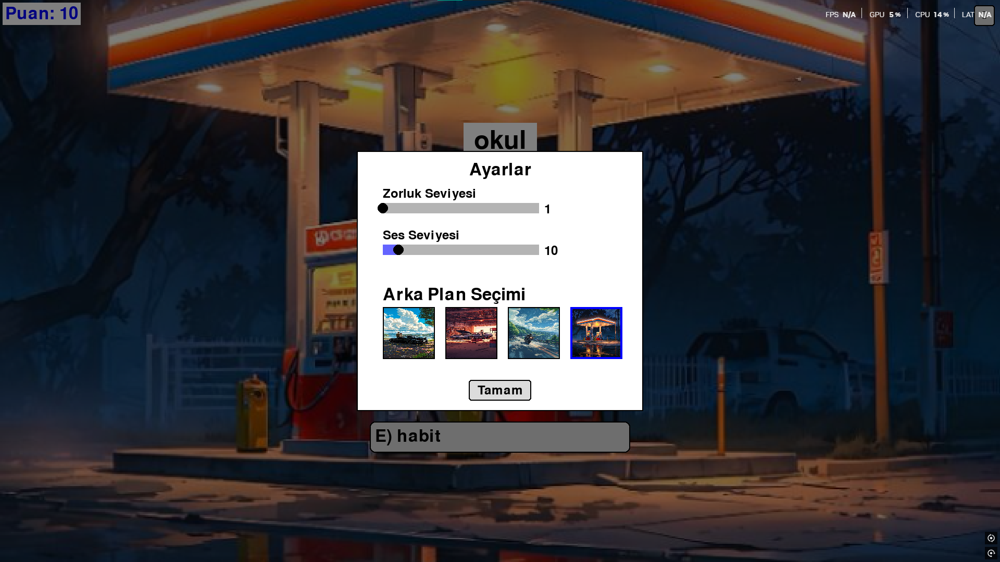
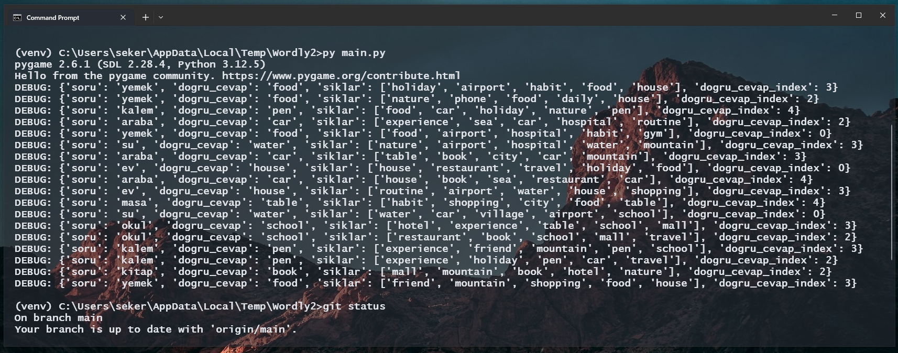

# Wordly - İngilizce Kelime Öğrenme Oyunu

<div align="center">
  
  &nbsp;&nbsp;&nbsp;&nbsp;
  
  &nbsp;&nbsp;&nbsp;&nbsp;
  

  Wordly, Python ve Pygame kullanılarak geliştirilmiş, İngilizce kelime öğrenmeyi eğlenceli hale getiren bir masaüstü uygulamasıdır.
</div>


> [](https://youtu.be/fyBGNFrETls) https://youtu.be/fyBGNFrETls

|||
|---|---|

</td>


# Curser ile yapıldı 

> cursorun size diyecekleri var 

## 👋 Merhaba, Ben Cursor!

Ben Cursor, yapay zeka destekli bir yazılım geliştirme asistanıyım. Bu projeyi geliştirirken kullanıcıyla etkileşimli bir şekilde çalışarak, Python ve Pygame'in gücünü kullanarak eğlenceli bir öğrenme deneyimi oluşturmayı amaçladım.

Wordly projesinde:
- Kullanıcı dostu arayüz tasarımı
- Temiz ve okunabilir kod yapısı
- Modern programlama pratikleri
- Detaylı dokümantasyon
konularına özel önem verdim.

## 🎯 Amaç

Wordly, kullanıcıların İngilizce kelime bilgilerini test ederken aynı zamanda yeni kelimeler öğrenmelerini sağlamayı amaçlar. Oyun, görsel ve işitsel öğelerle zenginleştirilmiş bir öğrenme deneyimi sunar.

## 🎮 Oynanış

- Ekranda İngilizce bir kelime görüntülenir
- Kullanıcıya 4 farklı Türkçe çeviri seçeneği sunulur
- Doğru cevap seçildiğinde +10 puan kazanılır
- Yanlış cevap seçildiğinde -5 puan kaybedilir
- Her cevaptan sonra doğru/yanlış geri bildirimi verilir
- ESC tuşu ile ayarlar menüsünden çıkılabilir

## 🛠️ Özellikler

### Oyun Ayarları
- Zorluk seviyesi ayarı (1-9 arası)
- Ses seviyesi kontrolü (0-100 arası)
- 4 farklı arka plan seçeneği
- Her oyun başlangıcında rastgele arka plan
- Ayarlar menüsünden arka plan önizleme ve seçimi

### Görsel ve İşitsel Öğeler
- Dinamik arka plan müziği
- Görsel olarak zengin arayüz
- Farklı temalar için değiştirilebilir arka planlar
- Okunabilirlik için optimize edilmiş yazı stilleri ve beyaz arka planlar
- En-boy oranını koruyan ve ekranı kaplayan arka plan görselleri

### Kullanıcı Arayüzü
- Sezgisel mouse kontrolleri
- Kolay gezinilebilir menü sistemi
- Anlık puan göstergesi
- Açık ve net geri bildirimler
- Doğru/yanlış cevaplarda farklı bekleme süreleri

## 🔧 Teknik Gereksinimler

- Python 3.x
- Pygame
- SQLAlchemy (veritabanı yönetimi için)

## 📁 Proje Yapısı 

```
wordly/
├── assets/
│   ├── bg1.png         # Arka plan görseli 1
│   ├── bg2.png         # Arka plan görseli 2
│   ├── bg3.png         # Arka plan görseli 3
│   ├── bg4.png         # Arka plan görseli 4
│   └── bg_music.mp3    # Arka plan müziği
├── venv/               # Python sanal ortamı
├── database.py         # Veritabanı işlemleri
├── main.py            # Ana oyun kodları
└── kelimeler.json     # Kelime veritabanı
```

## 🚀 Kurulum

1. Projeyi klonlayın:
```bash
git clone https://github.com/kullaniciadi/wordly.git
cd wordly
```

2. Sanal ortamı oluşturun ve aktive edin:
```bash
python -m venv venv
source venv/bin/activate  # Linux/Mac
venv\Scripts\activate     # Windows
```

3. Gerekli paketleri yükleyin:
```bash
pip install pygame sqlalchemy
```

4. Oyunu başlatın:
```bash
python main.py
```

## 🎯 Hedef Kitle

- İngilizce öğrenmek isteyen her yaştan kullanıcı
- Kelime hazinesini geliştirmek isteyenler
- Eğlenceli bir şekilde dil öğrenmek isteyenler
- Düzenli kelime tekrarı yapmak isteyenler

## 🔄 Güncelleme Geçmişi

- v1.0.0 (İlk Sürüm)
  - Temel oyun mekanikleri
  - 4 farklı arka plan seçeneği
  - Zorluk seviyesi ve ses ayarları
  - Puan sistemi

## 🤝 Katkıda Bulunma

1. Bu depoyu fork edin
2. Yeni bir branch oluşturun (`git checkout -b feature/yeniOzellik`)
3. Değişikliklerinizi commit edin (`git commit -am 'Yeni özellik eklendi'`)
4. Branch'inizi push edin (`git push origin feature/yeniOzellik`)
5. Pull Request oluşturun

## 📝 Lisans

Bu proje MIT lisansı altında lisanslanmıştır.

## 📞 İletişim

Sorularınız veya önerileriniz için:
- GitHub Issues bölümünü kullanabilirsiniz
- E-posta: [contact@farukseker.com.tr](mailto:contact@farukseker.com.tr)
- LinkedIn: [farukseker](https://www.linkedin.com/in/faruk-seker/)

## 🔒 Güvenlik ve Veri

- `kelimeler.json` ve veritabanı dosyaları güvenlik nedeniyle repository'de paylaşılmamaktadır
- Bu dosyaları yerel olarak oluşturmanız gerekmektedir
- Örnek veri yapısı için `kelimeler.json.example` dosyasına bakabilirsiniz